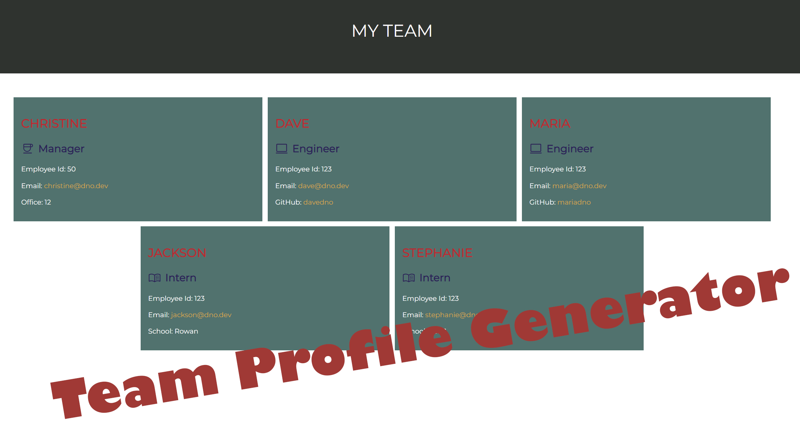

# README.md Generator

  ## Table of Contents

  * [Description](#description)
  * [Installation](#installation)
  * [Usage](#usage)
  * [Contributing](#contributing)
  * [License](#license)
  * [Questions](#questions)

  ## Description

*Built using:*
- Node.js®
- JavaScript
- HTML
- CSS

  This is an application that can be used to create a webpage that displays a team's employees and contact information. The inquirer node package is used to prompt the user for information about each team member. Then the file system package is used to generate an html file that dispalys the team's information with links that make it easy to reach out to your team via email. 

  ## Installation

  *To set up this file locally...*

   - Clone this repo to your computer
   - Run `npm i` to install the dependencies

  ## Usage
  
  To start the application: `node index`

  The command line will then prompt a series of questions. Answer the questions as they pertain to the team dashboard you are building.

  Once the prompts are complete, an html file will be created with the information provided in the **/dist** folder. Open the file in the browser to view the new dashboard!

  You can find a video tutorial showing how to use this application on my [youtube](https://youtu.be/) channel.

  ## Tests

  Tests for this application were built with Jest. 

  To run the tests: `npm run tests`

  ## Contributing

  [Inquirer](https://www.npmjs.com/package/inquirer) was used to create the interactive command line user interface.
  
  [Jest](https://jestjs.io/) was used for creating the tests.

  ## License
  
  Copyright © 2022 Christine Diienno

  This project is licensed under the [MIT License](https://mit-license.org/).

  ## Questions

  Do you have any questions? 

  Checkout the youtube video explaining how to use the application: [youtube](https://youtu.be/rtxqu2zcx-w)

  You can find my github profile here: [mrsdno](https://github.com/mrsdno)
  
  Or you can email me here: [christine@dno.dev](mailto:christine@dno.dev)

